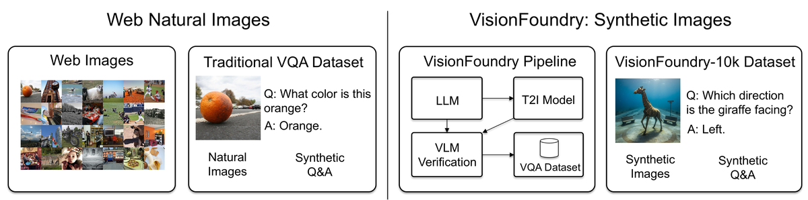

# VisionFoundry: Teaching VLMs Visual Perception with Synthetic Images

[Guanyu Zhou](https://the-martyr.github.io/)<sup>1</sup>, [Yida Yin](https://davidyyd.github.io/)<sup>1</sup>, [Wenhao Chai](https://wenhaochai.com/)<sup>1</sup>, [Shengbang Tong](https://tsb0601.github.io/)<sup>2</sup>, [Xingyu Fu](https://zeyofu.github.io/)<sup>1</sup>, [Zhuang Liu](https://liuzhuang13.github.io/)<sup>1</sup>

<sup>1</sup>Princeton University, <sup>2</sup>New York University



[](https://zlab-princeton.github.io/VisionFoundry) [](https://arxiv.org/abs/2604.09531) [](https://github.com/zlab-princeton/VisionFoundry) [](https://huggingface.co/datasets/zlab-princeton/VisionFoundry-10K) [](LICENSE)

<p style="font-size: 18px;">Use VisionFoundry to generate your own Synthetic Images Dataset with just one <strong>keyword</strong>!</p>

## Installation

<details>
<summary><strong>Training</strong></summary>

We use the [ms-swift](https://github.com/modelscope/ms-swift) framework for SFT training. Please follow the official installation guidance and ensure your environment matches the recommended versions. The simplest install is:

```bash
pip install ms-swift -U
```

If you need a source install, you can clone the repo and run `pip install -e .` as documented. Refer to the official [ms-swift](https://github.com/modelscope/ms-swift) README for full requirements and options.

</details>

<details>
<summary><strong>Evaluation</strong></summary>

We use [VLMEvalKit](https://github.com/open-compass/VLMEvalKit) for evaluation. A minimal setup follows the official quickstart:

```bash
git clone https://github.com/open-compass/VLMEvalKit.git
cd VLMEvalKit
pip install -e .
```

Then configure model paths and keys, and run evaluations with `python run.py ...` or `torchrun ...` as needed.

</details>

## VisionFoundry

The VisionFoundry pipeline is implemented in `data_engine/vision_foundry.py`. It generates synthetic VQA data and images using OpenAI and Gemini APIs.

### Dependencies

We run the pipeline inside the [ms-swift](https://github.com/modelscope/ms-swift) environment and add the following packages:

```bash
pip install openai google-genai pillow requests tqdm numpy
```

### API Configuration

Copy and edit `data_engine/config.example.json` (or provide your own JSON via `--api_config`). The default configuration uses the official OpenAI and Gemini APIs. You can set a custom OpenAI-compatible base URL by editing the `base_url` field in the config if needed.

Required environment variables:

- `OPENAI_API_KEY`
- `GEMINI_API_KEY`

### Usage

Example (single-image mode):

```bash
python data_engine/vision_foundry.py \
  --task "<YOUR_TASK_DESCRIPTION>" \
  --num 200 \
  --mode single \
  --output_dir ./output \
  --annotation_output annotations.json \
  --prompts_output prompts.jsonl \
  --statements_output statements.jsonl \
  --pool_output pool.json \
  --api_config data_engine/config.example.json
```

Example (multi-image mode):

```bash
python data_engine/vision_foundry.py \
  --config /path/to/task_config.json \
  --num 200 \
  --mode multi \
  --num_images 3 \
  --multi_image_form story_chain \
  --output_dir ./output_multi \
  --api_config data_engine/config.example.json
```

<details>
<summary><strong>Parameters (All)</strong> — click to expand</summary>

- `--task`: Task short description (used when `--config` is not provided)
- `--config`: Path to JSON config file (task template)
- `--save_config_template`: Save example task templates to a path
- `--api_config`: Path to API config JSON
- `--num`: Number of cases to generate
- `--mode`: `single` or `multi`
- `--num_objects`: Number of objects per case
- `--num_images`: Number of images in multi mode
- `--multi_image_form`: `multi_generate`, `story_chain`, or `mixed`
- `--objects_size`: Size of auto-generated objects list
- `--attributes_size`: Size of auto-generated attributes list
- `--scenes_size`: Size of auto-generated scenes list
- `--styles_size`: Size of auto-generated styles list
- `--max_items_per_call`: Max items per LLM call for pool generation
- `--llm_decide_attr_size`: Let LLM estimate attribute pool size
- `--objects`: Custom object list
- `--attributes`: Custom attributes list
- `--scenes`: Custom scenes list
- `--styles`: Custom styles list
- `--global_pool`: Path to a global pool JSON
- `--generate_missing`: Auto-generate missing lists
- `--max_iter`: Max generation attempts per case
- `--output_dir`: Output directory
- `--annotation_output`: Annotation file name
- `--prompts_output`: Prompts file name
- `--statements_output`: Statements file name
- `--pool_output`: Pool file name
- `--seed`: Random seed
- `--parallel`: Number of parallel workers
- `--use_edit`: Enable image-editing repair after failed verification

</details>

### Outputs

The pipeline produces:

- `annotations.json`: Training annotations in multi-image or single-image format
- `prompts.jsonl`: Prompts used for image generation
- `statements.jsonl`: Verification statements
- `pool.json`: The final object/attribute/scene/style pool

## Training

We provide three training scripts under `train_scripts/`:

- `train_scripts/train_qwen.sh` (for [Qwen2.5-VL-3B-Instruct](https://huggingface.co/Qwen/Qwen2.5-VL-3B-Instruct))
- `train_scripts/train_mimo.sh` (for [MiMo-VL-7B-SFT](https://huggingface.co/XiaomiMiMo/MiMo-VL-7B-SFT))
- `train_scripts/train_llama.sh` (for [Llama-3.2-11B-Vision-Instruct](https://huggingface.co/meta-llama/Llama-3.2-11B-Vision-Instruct))

Each script contains two runnable templates:

- Local single-node (e.g., a single 8-GPU machine)
- Slurm cluster submission

Fill in the placeholders for model path, dataset path, output directory, and logging directory, then uncomment the section you want to use.

### Data Preparation

After downloading the dataset from HuggingFace:

```bash
huggingface-cli download zlab-princeton/VisionFoundry-10K
```

Then run `python restore_images_from_parquet.py` to rebuild the image folder structure from `images.parquet`. Each record in `annotations.json` contains a `messages` list and an `images` list following the ms-swift format.

### Dataset Format

We follow the [ms-swift](https://github.com/modelscope/ms-swift) multimodal SFT JSON format. Each item contains a `messages` list and an `images` list. A minimal single-image example:

```json
{
  "messages": [
    {"role": "user", "content": "<image>\nWhat is the color of the car?"},
    {"role": "assistant", "content": "red"}
  ],
  "images": ["/abs/or/rel/path/to/image.png"],
  "qid": 1
}
```

Multi-image examples use `<images>` in the user message and provide multiple image paths:

```json
{
  "messages": [
    {"role": "user", "content": "<images>\nWhat changed across the images?"},
    {"role": "assistant", "content": "the cup moved to the left"}
  ],
  "images": ["img_0.png", "img_1.png", "img_2.png"],
  "qid": 1
}
```

Our pipeline outputs `annotations.json` in this format. You can also prepare your own dataset by modifying the `annotations.json` accordingly.

To launch training, fill in the placeholders in one of the scripts and run:

```bash
bash train_scripts/train_qwen.sh
```

## Evaluation

We do not include custom evaluation code in this repo. Use [VLMEvalKit](https://github.com/open-compass/VLMEvalKit)'s built-in benchmark support:

1. Install [VLMEvalKit](https://github.com/open-compass/VLMEvalKit) (see above).
2. Configure your model in `vlmeval/config.py` and ensure the model weights are accessible.
3. Run evaluation, for example:

```bash
python run.py --data <BENCH1> <BENCH2> --model <MODEL_NAME> --verbose
```

For distributed inference, use `torchrun --nproc-per-node=<N> run.py ...`. See the [VLMEvalKit](https://github.com/open-compass/VLMEvalKit) quickstart for more details.

## License

This project is released under the Apache-2.0 license. See `LICENSE` for details.

## Citation

If you use this work, please cite:

```bibtex
@article{zhou2025visionfoundry,
  title={VisionFoundry: Teaching VLMs Visual Perception with Synthetic Images},
  author={Guanyu Zhou and Yida Yin and Wenhao Chai and Shengbang Tong and Xingyu Fu and Zhuang Liu},
  journal={arXiv preprint arXiv:2604.09531},
  year={2025}
}
```

## Acknowledgements

This project builds on several strong open-source foundations:

- [ms-swift](https://github.com/modelscope/ms-swift) for SFT training infrastructure
- [VLMEvalKit](https://github.com/open-compass/VLMEvalKit) for multimodal evaluation
